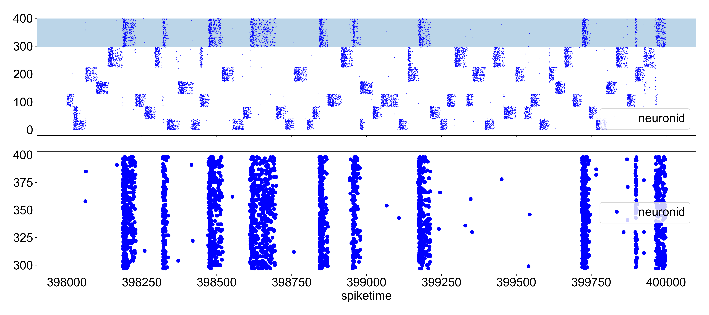

<div style="display: flex;">
  <div style="flex: 1; padding-right: 20px; width: 10%;">
    
  </div>
  <div style="flex: 4; padding-left: 20px; width: 90%;">
    <h1 style="font-size: 2em; font-weight: bold; margin: 0;">
      Self-organization of cell assemblies in a recurrent spiking neural network
    </h1>
  </div>
</div>

[](https://github.com/mkenney/software-guides/blob/master/STABILITY-BADGES.md#work-in-progress)
# Overview

This is an implementation of a recurrent binary spiking neural network written in C++ easily configurable through a Python API. 

# Quickstart

Clone this repo.

```bash
git clone https://github.com/RomanKoshkin/SoNNet.git
```

Build the C++ core by running the build script:

```bash
sh scripts/build_pybind.sh openmp
```

Run the demo script. 

```bash
python selforg_demo.py
```

The network will self-organize to about 8 cell assemblies (it will save some pictures in `assets`).


<p align="center">
  
</p>

# Experimentation

You can play around with different parameters and observe the network's emergent properties (e.g. the number of stable cell assemblies, time to self-organize, robustness to perturbations etc.). Feel free to explore and modify parameters in the YAML file in `configs`.

- change the network size
  - number of excitatroy and inhibitory neurons
- connection probabilities
- connection weight initializations
- network update frequency
- STDP window shape
  - time constants
  - degree of LTP and LTD
- STP parameters
  - facilitation and depression time constants

and **_more!_**

# TODO

- LIF neurons are already supported but LIF mode is not recommended yet.


  